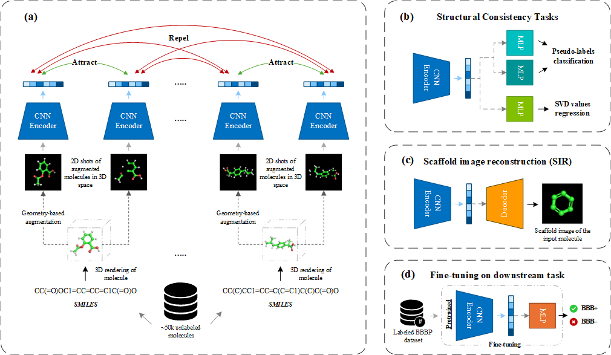

# BBBP-CGIM


**BBBP-CGIM: Blood-brain barrier permeability prediction via contrastive geometry image modeling**

Abbas Mehrbaniyan, Eghbal Mansoori, Reza Tahmasebi, and Armin Pishehvar  
School of Electrical and Computer Engineering, Shiraz University

Paper: **Soon**

<sub>The paper link will be added after publication.</sub>

## Abstract

**Background**: Predicting whether compounds cross the blood–brain barrier (BBB) is important for central nervous system drug development, yet the potential of molecular images to encode structural and spatial information remains underexplored. We developed a contrastive geometry image model (CGIM) to learn geometry-aware molecular representations for BBB permeability prediction.

**Results**: CGIM was pretrained on two-dimensional views rendered from augmented three-dimensional structures of 50,000 unlabeled PubChem molecules. The framework combined contrastive learning with scaffold-image reconstruction, pseudo-label classification for structural consistency, and TruncatedSVD component regression, and was then fine-tuned on the MoleculeNet BBBP, LightBBB, and B3DB datasets. Across five runs under scaffold-split evaluation, CGIM achieved the highest mean area under the receiver operating characteristic curve among the evaluated models on all three datasets: 72.68 ± 1.52%, 75.89 ± 0.52%, and 80.38 ± 0.54%, respectively. Corresponding areas under the precision–recall curve were 74.59 ± 2.48%, 76.21 ± 0.69%, and 89.43 ± 1.19%; these were highest on MoleculeNet BBBP and B3DB. The complete objective performed best in ablation experiments. Gradient-weighted class activation maps primarily highlighted molecule-occupied regions and local substructures associated with predictions, including a hydrogen-bonding vicinal diol in a BBB-impermeable compound, consistent with known determinants of poor permeability.

**Conclusions**: Geometry-derived molecular images, combined with multi-task contrastive pretraining, constitute a complementary and effective representation-learning modality for BBB permeability prediction, offering improved predictive performance and chemically interpretable visual cues that can support hypothesis generation in central nervous system drug discovery.

### Model overview



## News!

- **Soon** — The paper, processed datasets, split indices, and pretrained checkpoint will be released after publication.

## Environment setup

Python 3.10 or newer is required. A CUDA-capable GPU is recommended for pretraining and fine-tuning.

### Conda installation

Conda is recommended because RDKit and PyMOL are platform-dependent. From the repository root, create and activate the supplied environment:

```bash
conda env create -f environment.yml
conda activate bbbp-cgim
python -m pip install -e . --no-deps
```

The editable installation makes the `cgim` package importable while keeping the dependency versions defined in `environment.yml`.

### Pip installation

The project can also be installed in an existing Python environment. Install the training, evaluation, and molecular-rendering dependencies with:

```bash
python -m pip install --upgrade pip
python -m pip install -e ".[render]"
```

To use Grad-CAM, include the interpretation dependencies:

```bash
python -m pip install -e ".[render,plots]"
```

### Verify the installation

Run the following check before generating data or training a model:

```bash
python -c "import torch, rdkit, pymol; print('PyTorch:', torch.__version__); print('CUDA:', torch.cuda.is_available())"
```

If CUDA is expected but reported as unavailable, install a PyTorch build compatible with the CUDA driver on the machine. All pipelines can still be run on CPU by passing `--device cpu`, although pretraining will be considerably slower.

## Data and pretrained model

### Processed datasets

🔥 The processed datasets can be downloaded from the following table.

| Name | Download link | Description |
| --- | --- | --- |
| PubChem 50K | **Soon** | Pretraining CSV and rendered molecular images. Extract the files into `data/`. |
| MoleculeNet BBBP | **Soon** | Processed BBBP data and split information. Extract the files into `data/`. |
| LightBBB | **Soon** | Processed LightBBB data and split information. Extract the files into `data/`. |
| B3DB | **Soon** | Processed B3DB data and split information. Extract the files into `data/`. |

### Pretrained checkpoint

🔥 The pretrained CGIM encoder can be downloaded from the following table.

| Name | Download link | Description |
| --- | --- | --- |
| `best_3bpgim.pth` | **Soon** | Download the encoder and place it in `checkpoints/`. |

### Fine-tuned checkpoints

🔥 Fine-tuned checkpoints for the three evaluation datasets will also be provided.

| Name | Download link | Description |
| --- | --- | --- |
| MoleculeNet BBBP | **Soon** | Place `bbbp_best.pth` in `checkpoints/`. |
| LightBBB | **Soon** | Place `lightbbb_best.pth` in `checkpoints/`. |
| B3DB | **Soon** | Place `b3db_best.pth` in `checkpoints/`. |

<sub>Datasets, split indices, and pretrained checkpoints will be released after publication of the article.</sub>

The default dataset locations and required columns are:

| Dataset name | CSV location | Required columns |
| --- | --- | --- |
| `pubchem50k` | `data/raw/pubchem_50k.csv` | `smiles` |
| `bbbp` | `data/raw/bbbp.csv` | `smiles`, `p_np` |
| `lightbbb` | `data/raw/LightBBB.csv` | `smiles`, `BBclass` |
| `b3db` | `data/raw/B3DB_classification.csv` | `smiles`, `label` |

If a downloaded file uses a different filename or column name, update `configs/datasets.yaml` once. The same preparation and loading code is then reused by pretraining and all downstream pipelines. Generated CSV files store repository-relative image paths, and the loaders resolve those paths automatically so a generated dataset can be moved with the repository.

## Molecular image generation

Open `src/generate_dataset.py` and choose one or more datasets:

```python
DATASETS = ["pubchem50k"]

# Examples:
# DATASETS = ["bbbp"]
# DATASETS = ["bbbp", "lightbbb", "b3db"]
```

Then run the pipeline:

```bash
python src/generate_dataset.py
```

The same file can generate several datasets or override the data location:

```bash
python src/generate_dataset.py --datasets bbbp lightbbb b3db
python src/generate_dataset.py --datasets bbbp --raw-csv data/raw/bbbp.csv --image-root data/images --num-views 120
```

The default rendering procedure generates 120 views per molecule at 224 × 224 pixels using up to five conformers. The geometry-space augmentation uses independent rotations in `[-15°, 15°]` around each axis and atom masking sampled from `[0, 0.15]`. A fixed scaffold image is generated for the reconstruction target. Completed molecules are skipped when the script is restarted.

## Pretraining

The default pretraining settings are in `configs/pretrain.yaml`. Pretraining is independent of all BBBP labels and downstream metrics: the model is selected only when the total held-out pretraining loss decreases. Early stopping uses patience 10.

Open `src/pretrain.py` to select the dataset or training checkpoint:

```python
PRETRAIN_DATASET = "pubchem50k"
CHECKPOINT_PATH = None
```

Run:

```bash
python src/pretrain.py
```

Paths and common run settings can be overridden when needed:

```bash
python src/pretrain.py --dataset pubchem50k --processed-csv data/processed/pubchem_50k_processed.csv
python src/pretrain.py --checkpoint checkpoints/last_pretrain_checkpoint.pth --device cuda
```

The encoder is saved to `checkpoints/best_3bpgim.pth`. The most recent full training state is saved to `checkpoints/last_pretrain_checkpoint.pth`.

DCLW is the default pretraining loss. SimCLR, supervised contrastive loss, and supervised DCLW are also defined in `src/cgim/losses.py`. To use SimCLR, change the following value in `configs/pretrain.yaml`:

```yaml
training:
  contrastive_loss: simclr
```

## Fine-tuning

Open `src/finetune.py` and select a downstream dataset:

```python
DATASET = "bbbp"  # bbbp, lightbbb, or b3db
PRETRAINED_ENCODER_PATH = None
CHECKPOINT_PATH = None
```

With `PRETRAINED_ENCODER_PATH = None`, the pipeline reads the pretrained encoder path from the selected fine-tuning config. Run:

```bash
python src/finetune.py
```

For example, LightBBB can be selected without editing the file:

```bash
python src/finetune.py --dataset lightbbb --pretrained-encoder checkpoints/best_3bpgim.pth
```

The same pipeline is used for all three benchmarks. Dataset-specific label columns, fingerprint targets, duplicate handling, and scaffold splits are selected through `configs/datasets.yaml`; the BCE loss, optimizer, scheduler, early stopping, and checkpoint behavior remain shared.

## Evaluation

Open `src/evaluate.py` and select the dataset and checkpoint:

```python
DATASET = "bbbp"
CHECKPOINT_PATH = None
NUM_RUNS = 1
```

Run:

```bash
python src/evaluate.py
```

The evaluation reports ROC-AUC, PR-AUC, precision, recall, F1 score, accuracy, and Cohen's kappa for the training, validation, and test splits. With `CHECKPOINT_PATH = None`, the best checkpoint specified by the selected fine-tuning config is used.

## Grad-CAM

`src/gradcam.py` applies the binary-logit Grad-CAM procedure to an individual molecular image. Select the image and fine-tuned checkpoint either in the settings block or with arguments:

```bash
python src/gradcam.py --dataset bbbp --image data/images/bbbp/molecule_127/img_0.png
```

The overlay is saved under `outputs/<dataset>/` in SVG and high-resolution PNG formats by default. The destination and formats can be changed with `--output-prefix` and `--plot-formats`.

Every pipeline lists its complete optional interface with `--help`, while running it without arguments keeps the defaults shown above.

## Citation

If you use this repository, please cite the associated article. The final publication information will be added after publication.

```bibtex
@article{mehrbaniyan2026bbbpCGIM,
  title   = {BBBP-CGIM: Blood-brain barrier permeability prediction via contrastive geometry image modeling},
  author  = {Mehrbaniyan, Abbas and Mansoori, Eghbal and Tahmasebi, Reza and Pishehvar, Armin},
  journal = {Soon},
  year    = {2026}
}
```
